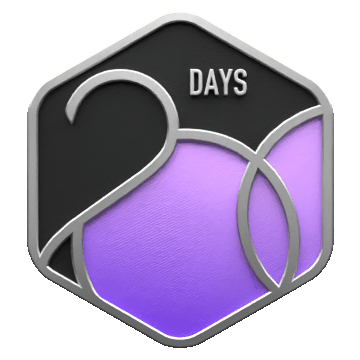
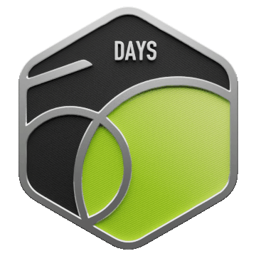
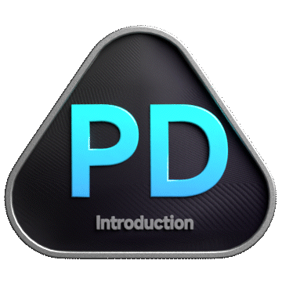
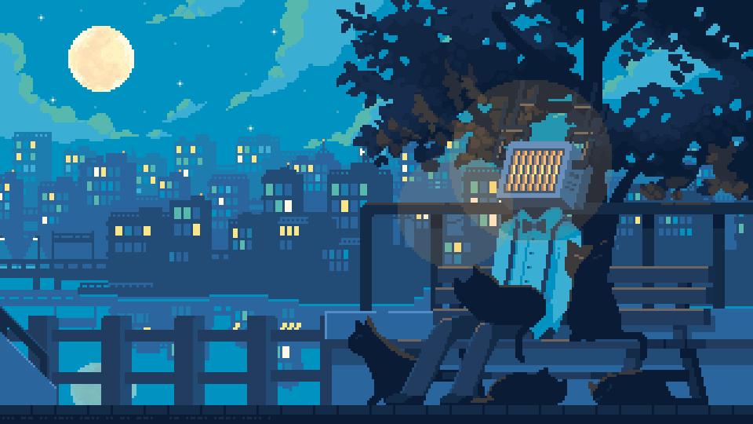

## Leetcode Badges

## HackerRank Badges

## Hi there 👋

- 🔭 I’m currently working on making this README.md
- 🌱 I’m currently learning to make this README.md
- 👯 I’m looking to collaborate on this README.md
- 🤔 I’m looking for help with this README.md
- 💬 Ask me about this README.md
- 📫 How to reach me: [Click Me](https://github.com/123JUICE-BOY321)
- 😄 Pronouns: Default 🧔🏻‍♂️
- ⚡ Fun fact: You just read my README.md

